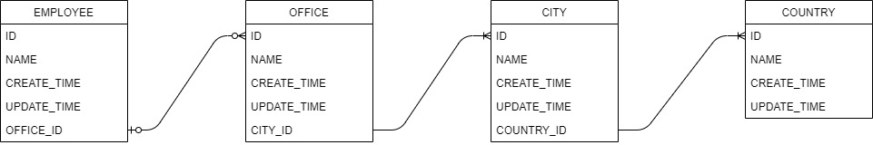
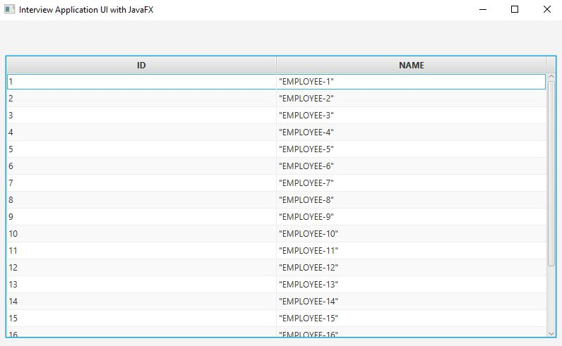

# luxInterview Project

This project is the "refactoring the existing codes" interview project. Basically, it is a Spring Boot RESTful Web API project to access and operate over some entities.

Basic JavaFX example is added to top of the  "refactoring the existing codes" for learning JavaFx concepts.

## Table of Contents

1. [Requirements](#requirements)
2. [Build and Run](#build-run)
3. [DB Diagram](#db-diagram)
4. [Improvements](#improvements)
5. [JavaFx](#javafx)

## <a name="requirements"></a>Requirements

Refactor the code to make it as clean as you can. Please keep in mind the following:

 * As for any refactor, the functionality should not change
 * Consider that nothing is yet delivered, meaning: 
    * Feel free to improve the database design if you find it necessary 
    * Feel free to improve rest interface if you find it necessary
 * Write a short summary or a list of the improvements you made.
 
## <a name="build-run"></a>Build and Run

 * Build: Because Lombok and MapStruct dependencies used in the project, ```mvnw clean install``` required.
 * Run: When app is run, it's root address is going to be: ```http://localhost:8080/api/```
    * Swagger UI address:  ```http://localhost:8080/api/swagger-ui/```
    * H2-Console address:  ```http://localhost:8080/api/h2-console/```
    

## <a name="db-diagram"></a>DB Diagram


 * Database design is changed for easy-to-maintain and high quality code. 
 * The project sent for refactoring had 2 tables which were Employee and Office.
 * Employees work in offices, offices are in the cities, cities are found in countries, so those 4 tables are separated.
 * This separation enables to the code the modularity and separation of concepts. 
 * Because there are relations between the entities, tables are connected to each other in hierarchical order as seen from the DB Diagram.
 * Tables are related to corresponding one with mandatory <b>One-To-Many</b> relation. Only Employee-Office tables have optional one-to-many relation.
 * The reason for above relation, a city has to be in a country, an office has to be in city. However, employee may not be in a office. For example, an employee may work from home. 
 
 * In each table:
    * ID column
        * Changed to ```Long``` type.
        * Annotated as ```Id``` which means primary key for the table.
        * Annotated as ```@GeneratedValue(strategy = GenerationType.IDENTITY)``` for auto incrementing. Also, given strategy defines the row is going to have unique id in each table.
    * NAME column
        * Has some size limitations and validation controls with annotations like @Size, @NotNull.
        * In country table, name of each country is set as unique.        
    * CREATE_TIME and UPDATE_TIME
        * All tables derive BaseEntity and these columns are derived from it.
        * The type of the columns are ```TimeStamp```.
        * Columns are going to be used for tracking time for the CRUD operations.
 
## <a name="improvements"></a>Improvements

 * As explained in the DB Diagram section, 4 entities are developed. Therefore, 4 Repositories and 4 Controllers are developed.
 * Each entity, has a its repository and a controller.
 * All 4 repositories are paging and sorting type of repositories. This enables GET services, which gathers list of data, pagination and sorting. 
 * For pagination and sort example, ```HTTP Get``` over ```http://localhost:8080/api/v1/employees?page=0&size=10&sort=id,desc``` would be queried.
 * All 4 controllers have CRUD operations to access and operate corresponding entities.
 * Please check out the [Swagger UI](http://localhost:8080/api/swagger-ui/) for the visualization of the web services. 
 * In controllers, field injections are changed to constructor injection.
 * server.servlet.context-path is set for ```/api```, for indicating to the users, it is the api of the project.
 * ```v1``` is added on top of all controller HTTP addresses. This is made for versioning of the web services in terms of further needs.
 * ```ResourceNotFoundException``` is developed for "404 not found" type of responses. 
 * In each controller, for the ```HTTP Post```(save) operations, DTO classes are developed. These classes' getter and setter methods are produced via Lombok.
 * Also, mapping form DTOs to Entities are provided via MapStruct. 
 * data.sql is added under resources for ease of testing with initial values.
 * Unit and Integration tests are developed. Unit Test line coverage: over 80%
 * Codes are scanned with SonarLint, no issue found.

## <a name="javafx"></a>JavaFx

 * For learning JavaFx concepts, a very basic JavaFx UI is added top of employee controller. As seen on the below image, that shows the employee id and name in a TableView.
 
